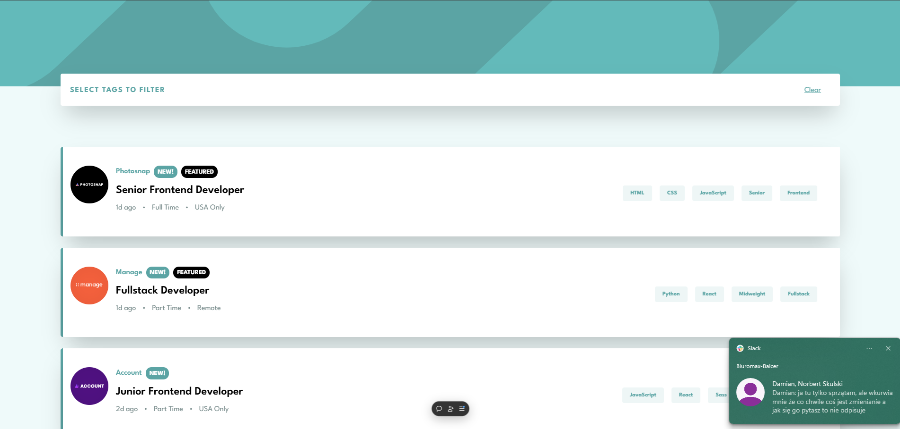

# Wstępne informacje

Aplikacja utworzona na podstawie projektu graficznego z strony: https://www.frontendmentor.io/challenges/job-listings-with-filtering-ivstIPCt

### `Uruchomienie programu za pomocą npm start`

Aplikacja dostępna lokalnie pod adresem [http://localhost:3000](http://localhost:3000)

### Aplikacja dostępna pod adresem: https://job-listings-mini-project.vercel.app/

### Zrzuty ekranu z aplikacji

